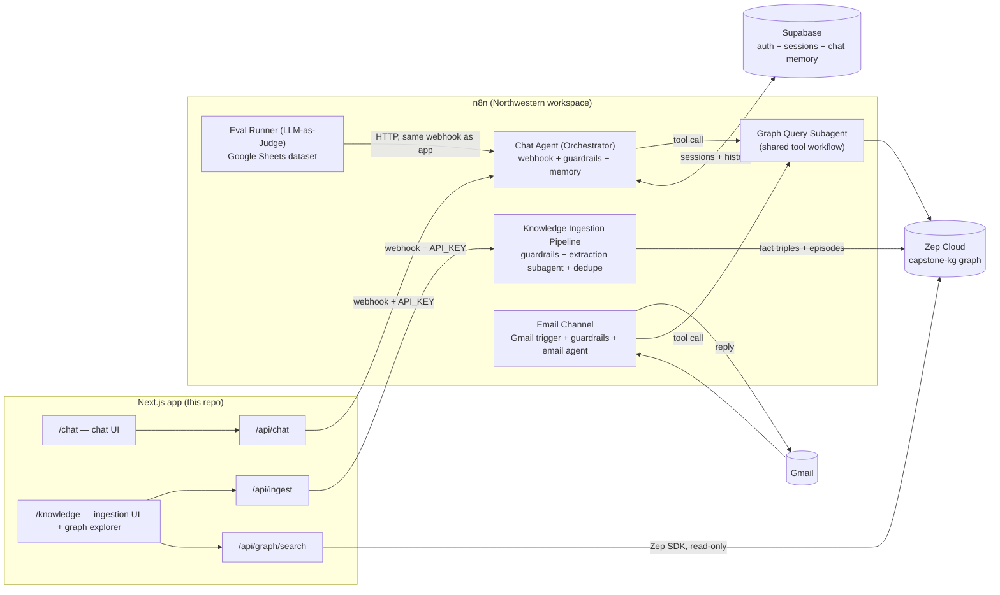

# DSGN-497 Capstone — Path B: Agentic Software Build

**Claude Code + n8n + Zep Knowledge Graph · two channels (app + email) · orchestration, evals, and guardrails integrated**

This repo is the full Path B capstone: a Next.js app (built on John's `mmm-cc-nextjs-template`), a five-workflow n8n suite, a Zep knowledge graph as the agent's second brain, an ingestion pipeline with its own UI, and an email channel. Everything below was verified end-to-end locally against a real n8n instance (20/20 workflow checks, 8/8 app checks, 298 unit/integration tests) using a mock LLM + mock Zep; the only things that need your real accounts are listed in [SETUP-CAPSTONE.md](./SETUP-CAPSTONE.md).

---

## Architecture

**The five n8n workflows** (`n8n/workflows/`):

| Workflow                             | Trigger                                   | Role                                                                                                                                                                        |
| ------------------------------------ | ----------------------------------------- | --------------------------------------------------------------------------------------------------------------------------------------------------------------------------- |
| `capstone-chat-agent.json`           | Webhook (`/capstone-agent`, header-auth)  | The orchestrator. Session upsert → input guardrails → agent (Postgres memory + graph tool) → output sanitization → respond.                                                 |
| `capstone-graph-query-subagent.json` | Execute-workflow trigger                  | The shared **graph-query subagent**: two Zep searches (edges + nodes) formatted into a compact FACTS/ENTITIES block. Called as a tool by both agents.                       |
| `capstone-ingestion-pipeline.json`   | Webhook (`/capstone-ingest`, header-auth) | Guardrails → **extraction subagent** (structured JSON) → entity dedupe against the live graph → Zep fact triples + episodes → transparent report.                           |
| `capstone-email-channel.json`        | Gmail trigger (unread, `-from:me`)        | Email guardrails → **email agent** (per-sender memory, same graph tool, cold-start prompt) → PII/secret sanitization → Gmail reply → mark read.                             |
| `capstone-eval-runner.json`          | Manual                                    | Reads the Google Sheets dataset, calls the production chat webhook per case, judges with a skeptical LLM judge (`{score, pass, justification}`), appends to `eval_results`. |

## The knowledge graph (the heart of Path B)

- **One shared standalone Zep graph** (`capstone-kg`), separate from the template's per-user memory graphs. The agent's "memory of the world" is collective; the user-graph memory remains personal context. That separation is deliberate: ingest once, every channel and every user benefits.
- **Writes** happen only through the ingestion pipeline: the extraction subagent produces `{entities[], relationships[]}`; relationships become explicit **fact triples** (`POST /graph/add-fact-triple`) so the graph edges carry typed relations (FOUNDED, ACQUIRED, TEACHES…); the raw text is also stored as **episodes**, so Zep's own temporal extraction keeps enriching the graph asynchronously and the source stays retrievable verbatim.
- **Dedupe / upsert** (the task-list upsert problem, applied to nodes): before writing, each extracted entity is searched against the graph (`scope: nodes`); a normalized-name match reuses the existing node's UUID — the triple attaches to the _existing_ node ("merged") instead of minting a duplicate. The ingestion report shows the merge decision per entity, and re-ingesting the same document produces `merged == entities, created == 0` (verified in the test harness).
- **Updates / contradictions**: handled at two levels — Zep's bi-temporal model invalidates contradicted facts from new episodes (`valid_at`/`invalid_at`), and the graph-query subagent surfaces those validity windows to the agent so it can prefer current facts.
- **Reads** happen through the Graph Query Subagent (edges + nodes searches, RRF-ranked, formatted for the prompt) — one implementation, used by both channels.

## Two channels

**App** — the template's chat UI calls `/api/chat`, which proxies to the orchestrator webhook with the shared `API_KEY` header. The `/knowledge` page is the ingestion UI (paste or upload `.txt`/`.md`, watch the extraction report) plus a read-only explorer over the _same_ graph the agent queries.

**Email** — the Gmail trigger polls unread mail, guardrails screen the subject+body, the email agent answers grounded in the same graph, replies in-thread as plain text, and marks the message read (the read-status flip is the reprocessing guard). Email-specific decisions: cold-start prompt (a reply must stand alone), per-sender memory keyed `email-<address>` (continuity across emails without a session UI), plain-text formatting with a fixed signature, and stricter injection screening because email is a public-ish entry point.

## Orchestration, evals, guardrails (carried forward, not bolted on)

- **Orchestration**: orchestrator agent → graph-query subagent (tool workflow) and extraction subagent (ingestion chain); the email agent is a second persona over the same subagent. Models follow the class multi-LLM pattern: `anthropic/claude-sonnet-4.6` for agents, `openai/gpt-5-mini` for guardrail checks/utility chains, and a _different-family_ judge for evals — all via OpenRouter.
- **Evals**: the eval runner mirrors John's Runner+Judge pattern — 12-case dataset (`eval/eval_dataset.csv`) across four dimensions (`correctness`, `graph_grounding`, `guardrail_safety`, `honesty`), judged 1–5 with `pass = score ≥ 4`, results appended to the sheet with justifications. It calls the **production webhook**, so it exercises the same path the app uses — guardrails included.
- **Guardrails** (same primitives, different deployment points than evals — eval measures after, guardrail blocks before):
  - _Input rails, both channels_: jailbreak (LLM, threshold 0.75), custom prompt-injection rail (LLM, 0.7), secret-key detector. Fail branch returns/replies a refusal naming the tripped rail.
  - _Ingestion rail_: secret-key scan before any model sees the document (HTTP 422 with reason).
  - _Output rails, both channels_: sanitize-mode redaction of credit cards / SSNs / bank numbers / IPs / secret keys before the response leaves the system.
  - _Channel auth_: both webhooks require the `API_KEY` header (matching the template's contract).

## Trade-offs (the things John actually grades)

1. **Why a separate graph-query subagent workflow instead of an inline HTTP tool?** One implementation shared by two agents, independently testable, and its executions are visible in n8n — you can _show_ the subagent being called in the demo. Cost: one cross-workflow reference to re-select after import.
2. **Why explicit fact triples _and_ episodes, not just `graph.add`?** Triples make the extraction step demonstrable and give us control over dedupe (UUID reuse); episodes keep provenance and let Zep's temporal engine catch what our extractor misses. Pure episode ingestion would hide the "agent earns its keep" extraction step; pure triples would lose source text and temporal invalidation.
3. **Why dedupe by normalized-name search instead of trusting Zep alone?** It makes the upsert decision _ours_ and _visible_ (the report labels merged vs new). Trade-off: near-duplicates with different surface forms ("J. Renaldi") still rely on Zep's resolution — acceptable, and the canonical-name rule in the extraction prompt minimizes it.
4. **Why `responseMode: responseNode` instead of token streaming?** Deterministic guardrails: you cannot sanitize a stream you've already sent, and the refusal branch needs to answer through the same webhook. We trade streaming UX for enforceable output rails (the template's UI handles non-streamed text fine).
5. **Why the eval runner calls the production webhook instead of n8n's native evaluation trigger?** It tests the real deployed path (auth, guardrails, agent, graph) exactly as users hit it, works on any plan, and matches John's current Runner+Judge template. Trade-off: no native Evaluations-tab charts; scores live in the sheet.
6. **Why per-sender memory for email but per-session for chat?** Email has no session UI — the sender address _is_ the session. Chat sessions come from the app sidebar contract (`n8n_chat_sessions`).
7. **Why two LLM tiers?** Guardrail checks and utility chains run constantly and need low latency/cost (`gpt-5-mini`); agent reasoning gets the stronger model; the judge stays a different family from the generator to reduce self-preference bias (Module 3).
8. **Why the document node + MENTIONED_IN fallback in extraction?** Guarantees every entity is connected (no orphan nodes), gives provenance edges for free, and makes "what did this document teach the graph?" answerable.

## What flat RAG wouldn't have given us (reflection seed)

- "Who founded Jiobit and what happened to it?" is answered from **two typed edges** (`FOUNDED`, `ACQUIRED`) that can come from _different documents_ — chunk retrieval only answers it if some single chunk happens to contain both facts.
- Dedupe means the second document about John Renaldi **enriches the same node** instead of creating a competing chunk; the graph accumulates a single evolving picture per entity (the E2E run shows `merged: 3` when the guest-speaker doc mentions entities the instructor bio created).
- Bi-temporal facts (`valid_at`/`invalid_at`) give the agent a way to answer "as of when?" — embeddings have no notion of a fact being superseded.
- The two-channel design forced decisions a single chat UI never would: cold-start prompting, per-sender identity, plain-text output discipline, reply-loop guards, and treating inbound email as untrusted input with harder injection screening.

## Verification (what was tested without real credentials)

- `scripts/verify/run-local-verification.sh` — spins a real n8n in Docker, imports all five workflows, wires mock credentials (mock OpenRouter LLM + mock Zep on :4545, local Supabase Postgres), publishes, and runs 20 assertions: ingestion E2E + dedupe-on-reingest + guardrail block + webhook auth + graph-grounded chat + session/memory rows + injection refusals on both channels + the full eval loop. **20/20.**
- `scripts/verify/run-app-e2e.sh` — boots the real Next.js app against that stack and verifies auth gating, the Knowledge page, ingestion through the app, the graph explorer, and graph-grounded + guardrail-refused chat through `/api/chat`. **8/8.**
- `npm test` (298 tests), `npm run type-check`, `npm run lint`, `npm run test:coverage` (≥80% global), `npm run build` — all green.

What still needs _your_ accounts (one-time, ~20 min): Zep API key, OpenRouter key, the Northwestern n8n import + credential picks, the eval Google Sheet, and the Gmail OAuth for the email channel — step-by-step in [SETUP-CAPSTONE.md](./SETUP-CAPSTONE.md), demo plan in [DEMO-SCRIPT.md](./DEMO-SCRIPT.md).

## AI Use Disclosure

Built with **Claude Code (Claude Fable 5)** operating autonomously over the instructor-provided `mmm-cc-nextjs-template`: it authored the five n8n workflow JSONs, the Knowledge page + API routes + tests, the mock LLM/Zep harness and verification scripts, the eval dataset, and this documentation; it verified everything against a local n8n + Supabase + mock stack before handoff. Prompts: the Path B assignment text, the course syllabus, class Slack excerpts, and John's example workflows (eval Runner+Judge, Multi-Agent template) as pattern references. Models inside the product: `anthropic/claude-sonnet-4.6` (agents), `openai/gpt-5-mini` (guardrails, utility chains, judge) via OpenRouter. Human-owned: account credentials, the Northwestern n8n import, the recorded demo, and final narrative edits.
